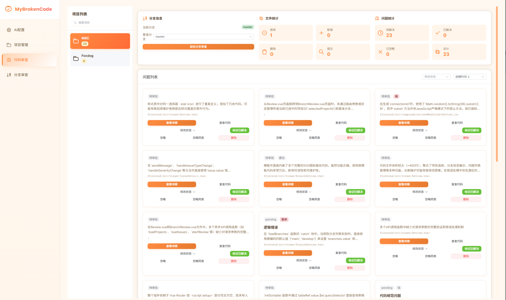
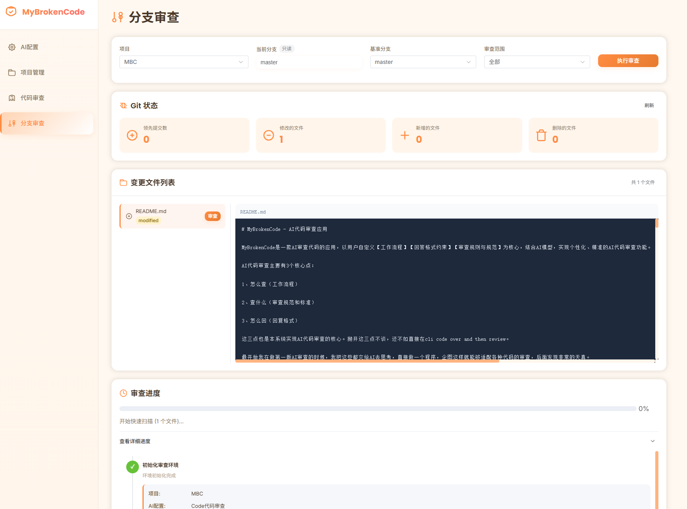
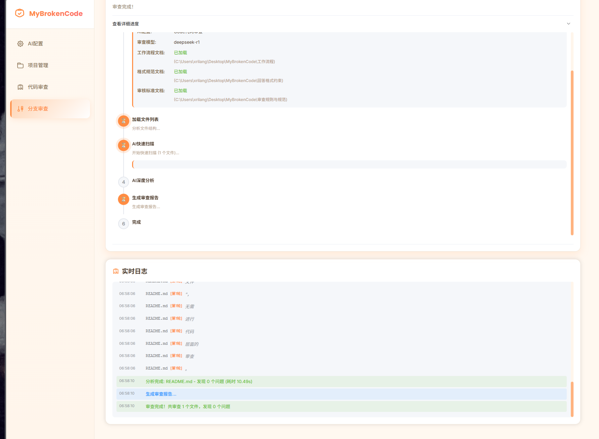

# MyBrokenCode - AI代码审查应用

MyBrokenCode是一款AI审查代码的应用，以用户自定义【工作流程】【回答格式约束】【审查规则与规范】为核心，结合AI模型，实现个性化、精准的AI代码审查功能。

AI代码审查主要有3个核心点：

1、怎么查（工作流程）

2、查什么（审查规范和标准）

3、怎么回（回复格式）

这三点也是本系统实现AI代码审查的核心。抛开这三点不谈，还不如直接在cli code over and then review。

最开始我在做第一版AI审查的时候，我把这些都交给AI去思考，直接做一个程序，企图这样就能够适配各种代码的审查，后面发现非常的天真。

思来想去，还是需要参考skill和agent的模式，把制定规则的权利，交到用户手上，这样才能尽可能的去适配（但是为了更好的在吸引上展示，回复格式可能没法让用户去自定义，能实现虽然能实现，只是代码上也需要适配下，目前的代码是不适配的（写的不太灵活））

我需要自行经过一段时间的实际体验和优化。

## 技术栈

- **后端**: Python 3.12 + FastAPI
- **前端**: Vue3 + Electron
- **数据库**: SQLite

## 项目结构

```
MyBrokenCode/
├── backend/                 # 后端代码
│   ├── main.py             # FastAPI主程序
│   ├── database.py         # 数据库模型
│   ├── schemas.py          # Pydantic模型
│   ├── git_service.py      # Git集成服务
│   ├── ai_service.py       # AI审查服务
│   └── requirements.txt    # Python依赖
├── frontend/               # 前端代码
│   ├── src/
│   │   ├── views/         # 页面组件
│   │   │   ├── AIConfig.vue      # AI配置页面
│   │   │   ├── Projects.vue      # 项目管理页面
│   │   │   ├── Review.vue        # 代码审查页面
│   │   │   └── BranchReview.vue  # 分支审查页面
│   │   ├── api/           # API调用
│   │   ├── router/        # 路由配置
│   │   ├── App.vue        # 主组件
│   │   └── main.js        # 入口文件
│   ├── electron/          # Electron主进程
│   ├── package.json
│   └── vite.config.js
├── 工作流程/              # 工作流程文档
├── 回答格式约束/          # 回答格式约束文档
└── 审查规则与规范/        # 审查规则与规范文档
```

## 快速开始

### 1. 环境要求

- Python 3.12+
- Node.js 18+
- Git

### 2. 后端启动

```bash
# 进入后端目录
cd backend

# 安装依赖
pip install -r requirements.txt

# 启动后端服务
python main.py
```

后端服务将在 `http://localhost:8000` 启动

### 3. 前端启动

```bash
# 进入前端目录
cd frontend

# 安装依赖
npm install

# 开发模式启动（Web版）
npm run dev

# 或启动Electron桌面应用
npm run electron:dev
```

前端将在 `http://localhost:5173` 启动

> 建议dev启动，electron我没测




如果你想知道我怎么开发这个项目的，你可以看看 AIDevAgent.md 这个文件







我感觉，还行


## 功能模块

### 1. AI配置管理

- 配置AI接口（OpenAPI格式）
- 配置API密钥
- 选择审查模型和复查模型
- 设置流式输出
- 配置参考资料、回答格式规范、工作流程、审核标准
- 支持多个配置，同时只能激活一个

### 2. 项目管理

- 添加/编辑/删除项目
- 设置项目路径和子路径
- 配置基准分支
- 添加项目标签
- 项目备注
- 统计项目审查信息

### 3. 代码审查

- 查看项目问题列表
- 问题状态管理（待审批、待排期、修改中、待复查、已完成）
- 标记问题已解决/忽略
- 删除问题
- 问题筛选和统计

### 4. 分支审查（核心功能）

- 选择项目和分支进行审查
- 设置审查范围（已提交、暂存、未提交、全部）
- 执行AI代码审查
- 实时显示审查进度
- 查看审查结果
- 将审查结果添加到问题列表

## UI/UX设计

项目采用专业的设计系统：

- **配色方案**: Trust Blue (#2563EB) + Orange CTA (#F97316)
- **字体**: Poppins (标题) + Open Sans (正文)
- **风格**: 现代简约、开发者友好、深色侧边栏
- **响应式**: 支持桌面和移动端

## API文档

后端启动后，访问 `http://localhost:8000/docs` 查看完整的API文档（Swagger UI）

### 主要API端点

**AI配置**
- `GET /api/ai-configs` - 获取所有配置
- `POST /api/ai-configs` - 创建配置
- `PUT /api/ai-configs/{id}` - 更新配置
- `DELETE /api/ai-configs/{id}` - 删除配置
- `PUT /api/ai-configs/{id}/activate` - 激活配置

**项目管理**
- `GET /api/projects` - 获取所有项目
- `POST /api/projects` - 创建项目
- `PUT /api/projects/{id}` - 更新项目
- `DELETE /api/projects/{id}` - 删除项目
- `GET /api/projects/{id}/branches` - 获取项目分支列表

**问题管理**
- `GET /api/issues` - 获取问题列表
- `POST /api/issues` - 创建问题
- `PUT /api/issues/{id}/status` - 更新问题状态
- `PUT /api/issues/{id}/resolve` - 标记已解决
- `DELETE /api/issues/{id}` - 删除问题

**代码审查**
- `POST /api/reviews/execute` - 执行代码审查

## 数据库

项目使用SQLite数据库，数据库文件 `mybrokencode.db` 会在首次启动后端时自动创建。

### 数据表

- `ai_configs` - AI配置
- `projects` - 项目信息
- `issues` - 问题记录
- `review_records` - 审查记录
- `chat_history` - 对话历史
- `project_stats` - 项目统计

## 开发计划

当前已完成：
- ✅ 后端基础架构（FastAPI + SQLite）
- ✅ 数据库设计和模型
- ✅ 前端基础架构（Vue3 + Electron）
- ✅ 专业UI/UX设计系统
- ✅ AI配置管理页面
- ✅ 项目管理页面
- ✅ 代码审查页面
- ✅ 分支审查页面
- ✅ AI审查核心功能（工作流程执行）
- ✅ Git集成服务

待开发功能：
- ⏳ 问题详情页面
- ⏳ AI对话功能
- ⏳ 文件路径选择器（Electron原生对话框）
- ⏳ 拖拽排序功能
- ⏳ 流式输出显示
- ⏳ WebSocket实时通信

## 注意事项

1. **API密钥安全**: 生产环境需要对API密钥进行加密存储
2. **跨平台路径**: 已支持Windows和Unix路径格式
3. **Git仓库**: 项目路径必须是有效的Git仓库
4. **端口占用**: 确保8000（后端）和5173（前端）端口未被占用

## 贡献

欢迎提交Issue和Pull Request！

## 许可证

GPL-2.0
